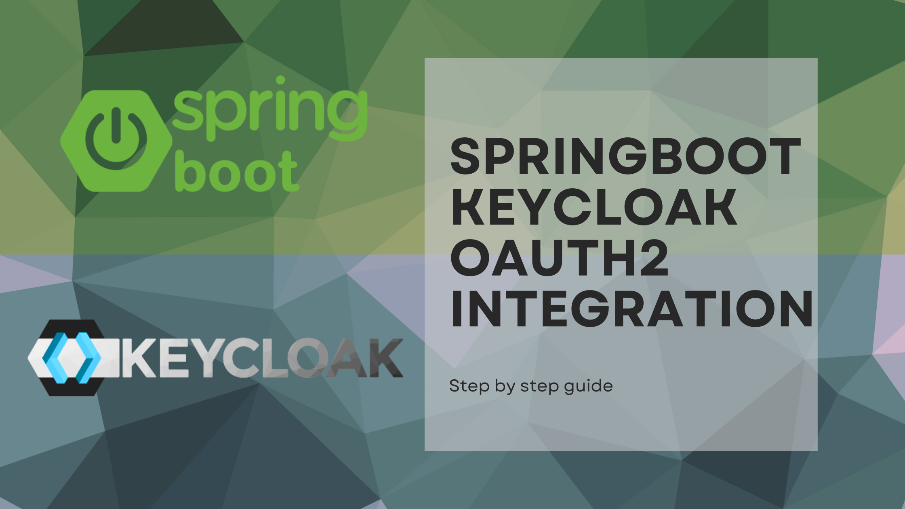

<p align="center">
    <a href="https://github.com/RubenMorPov/spring-keycloak-oauth2-example/releases/latest">
        
    </a>
</p>

This is a sample Spring MVC application that is integration with an OAuth2 service: Keycloak.
It's mean to be used as a reference, so feel fre to use it as a template.

# Launching the project

This project is fully prepared to be deployed with docker, so, once cloned, and having docker installed, just execute:

```bash
docker compose up
```

This will deploy:
- A PostgreSQL container for Keycloak's data.
- A custom Keycloak image with health checks enabled.
- Another custom image with Java21 and Maven where the source code will be compiled and executed.

# More information

If you need more information about the code, don't forget to check my blog: [runesoft.net](https://runesoft.net)
